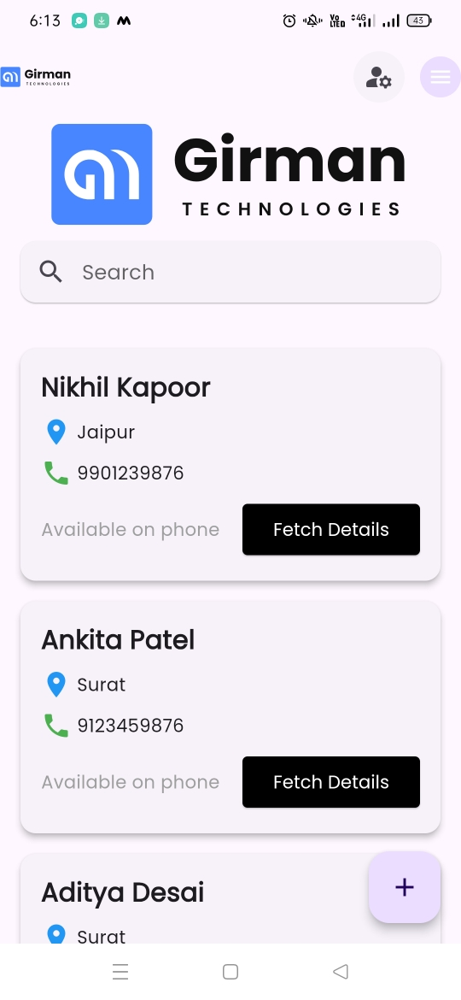
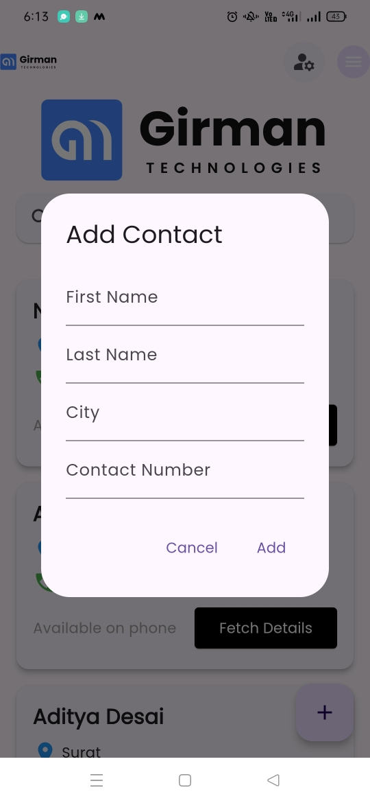
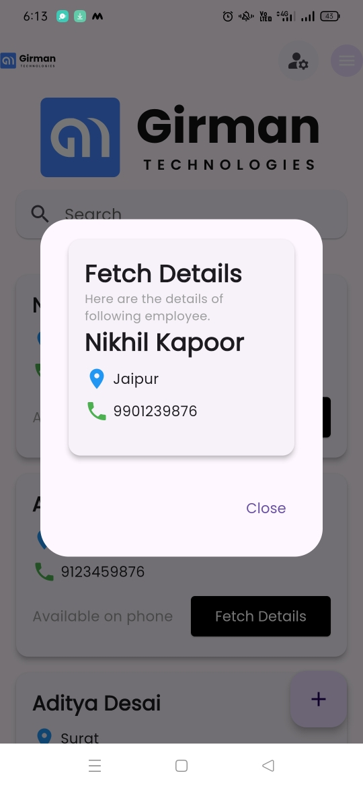

# Girman

## Project Overview

Girman is a Flutter application designed for managing and storing user contact information. The app allows users to add, search, and view their contacts efficiently. Built with a clean and user-friendly interface, Girman utilizes Firebase for backend data storage, enabling seamless data synchronization and retrieval.

## Features

- **Home Screen**: The main interface for viewing and managing contacts.
- **Add Contact Feature**: Users can easily add new contacts through a user-friendly dialog interface.
- **Search Functionality**: Quickly find contacts by searching through names and other details.
- **Dark/Light Mode Toggle**: Users can switch between dark and light themes for enhanced usability.
- **Firebase Integration**: Utilizes Firestore for real-time data storage and retrieval.

## Screenshots

### Home Screen


### Add Contact Dialog


### Search Results


## Home Screen

The home screen serves as the central hub for users. Key features include:

- **Display of Contacts**: Users can view a list of all saved contacts.
- **Add Contact Button**: A Floating Action Button (FAB) allows users to add new contacts.
- **Real-time Data**: Contacts are loaded from Firebase Firestore, ensuring the list is always up to date.

### Adding Contacts

When the FAB is tapped, a dialog appears for users to input their contact information:

- **First Name**
- **Last Name**
- **City**
- **Contact Number**

All fields must be filled in to add a new contact.

## Search Results Screen

The search results screen enables users to find contacts based on specific queries. Features include:

- **Search Bar**: Users can enter names, cities, or contact numbers to filter the contact list.
- **Dynamic Filtering**: The contact list updates in real-time based on the search input, making it easy to find specific contacts.

## Dark/Light Mode

Girman supports both dark and light modes. Users can easily switch between themes, enhancing the app's usability in different lighting conditions.

## Technology Stack

- **Flutter**: The framework used for building the mobile application.
- **Firebase**: Provides cloud-based storage using Firestore, allowing for real-time data management.
- **Bloc**: Implements state management for a reactive programming style.

## Setup Instructions

1. Clone the repository:
   ```bash
   git clone https://github.com/Prajit7/girman.git
   cd girman
